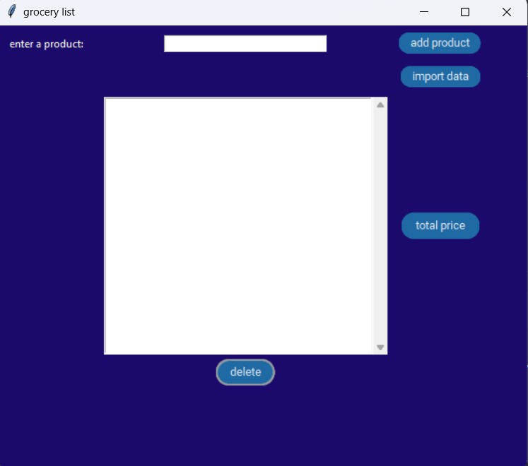

# GROCERY LIST APP

Note:

>Create or upload grocery lists for organized and efficient shopping.


Important:
```
make sure you imported these 4 modules, before started:

import tkinter as tk
import csv
import customtkinter as cst
from tkinter import messagebox
```

Don't forget:
```
the project contains the file with the grocery list database, don't forget
to import it:

from list_data import MyDbList
```

Preview:
